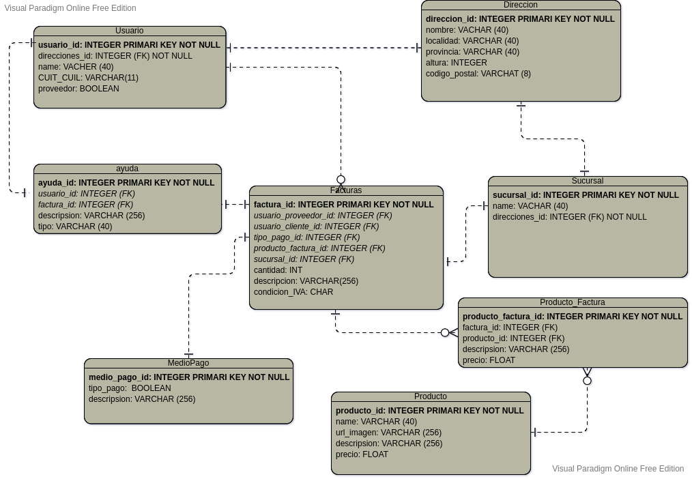

# TP BBDD I

## General :thinking:

Modelar, llenar y consultar una base de datos del tipo SQL usando las diferentes herramientas, comandos y principalmente conceptos adquiridos en el curso de la materia.

---
## Puntos necesarios :monocle_face:

1. Diagrama de entidad relación DER de la base de datos mostrando la información básica como son: entidades y sus atributos (indicando tipo e información especial como Pk o Fk) y líneas de uniones con los símbolos correspondientes. Dicho diagrama debe tener un mínimo de 8 entidades y variedad de cardinalidades (uno a muchos, muchos a muchos y en lo posible alguna relación uno a uno).

2. Mostrar todos los comandos necesarios para la creación de las tablas del punto anterior.

3. Llenar las tablas con datos, coherentes y relevantes para el negocio.

4. Realizar y mostrar tres consultas complejas usando joins anidados y sus resultados, los cuales deben ser reveladores para el proposito de la base de datos.

---
## Herramientas utilizadas:
  - [SQLite](https://www.sqlite.org/index.html)
  - [GitHub](https://github.com/DIOLINK/TP-BBDD-I)
  - [Mockaroo](https://www.mockaroo.com/)

---
# E-COMMERCE 

## 1. Diagrama de entidad relación.


---
## 2. Los comandos necesarios para la creación de las tablas.

- USUARIO :busts_in_silhouette:
```
CREATE TABLE
    usuario (
        usuario_id INTEGER PRIMARY KEY NOT NULL,
        direcciones_id INTEGER NOT NULL REFERENCES direccion (direccion_id),
        nombre VARCHAR (40),
        CUIT_CUIL VARCHAR (11),
        proveedor BOOLEAN
    );
```


---
- DIRECCIÓN :houses:
```
CREATE TABLE
    direccion (
        direccion_id INTEGER PRIMARY KEY NOT NULL,
        name_calle VARCHAR (40),
        localidad VARCHAR (20),
        provincia VARCHAR (20),
        altura INTEGER,
        codigo_postal VARCHAR (8)
    );
```


---
- SUCURSAL :office:
```
CREATE TABLE
    sucursal (
        sucursal_id INTEGER PRIMARY KEY NOT NULL,
        nombre VARCHAR (45),
        direcciones_id INTEGER NOT NULL REFERENCES direccion (direccion_id)
    );
```


---
- PRODUCTO :mag:
```
CREATE TABLE
    producto (
        producto_id INTEGER PRIMARY KEY NOT NULL,
        name VARCHAR (40),
        url_image VARCHAR (256),
        description VARCHAR (256),
        precio FLOAT
    );
```


---
- MEDIO DE PAGO :credit_card: :dollar:
```
CREATE TABLE
    medio_pago (
        medio_pago_id INTEGER PRIMARY KEY NOT NULL,
        tipo_pago BOOLEAN,
        description VARCHAR (256)
    );
```


---
- FACTURAS :receipt:
```
CREATE TABLE
    facturas (
        factura_id INTEGER PRIMARY KEY NOT NULL,
        usuario_proveedor_id INTEGER REFERENCES usuario (usuario_id),
        usuario_cliente_id INTEGER REFERENCES usuario (usuario_id),
        tipo_pago_id INTEGER REFERENCES MedioPago (medio_pago_id),
        producto_id INTEGER REFERENCES producto (producto_id),
        sucursal_id INTEGER REFERENCES sucursal (sucursal_id),
        cantidad INTEGER,
        descripcion VARCHAR (256),
        condicion_IVA CHAR
    );
```


---
- AYUDA :information_source:
```
CREATE TABLE
    ayuda (
        ayuda_id INTEGER PRIMARY KEY NOT NULL,
        usuario_id INTEGER REFERENCES usuario (usuario_id),
        factura_id INTEGER REFERENCES facturas (factura_id),
        description VARCHAR (256),
        tipo VARCHAR (40)
    );
```


---

## 3. Llenar las tablas con datos.
- USUARIO :busts_in_silhouette:
```
insert into
    usuario (
        usuario_id,
        nombre,
        direcciones_id,
        CUIT_CUIL,
        proveedor
    )
values (
        1,
        'Susanetta Jaycox',
        1,
        '27300189358',
        false
    ), (
        2,
        'Hilary McIlvenny',
        2,
        '28282042115',
        false
    ), (
        3,
        'Gayleen Hanbury',
        3,
        '23283375681',
        false
    ), (
        4,
        'Madeline Sowden',
        4,
        '30128980805',
        true
    ), (
        5,
        'Woodman Bruton',
        5,
        '27348341897',
        false
    ), (
        6,
        'Curran Digginson',
        6,
        '20390314643',
        false
    ), (
        7,
        'Georgena Matuschek',
        7,
        '21325549216',
        false
    ), (
        8,
        'Miles Pawnsford',
        8,
        '27302140360',
        false
    ), (
        9,
        'Pace Eckels',
        9,
        '20329133565',
        false
    ), (
        10,
        'Ronnica Billin',
        10,
        '31571243808',
        true
    );
```
---
- DIRECCIÓN :houses:

```
insert into
    direccion (
        direccion_id,
        name_calle,
        localidad,
        provincia,
        altura,
        codigo_postal
    )
values (
        1,
        'Shoshone',
        'Além do Rio',
        'Braga',
        '265',
        '4890'
    ), (
        2,
        'Kedzie',
        'Várzea',
        'Braga',
        '892',
        '4755'
    ), (
        3,
        'Shopko',
        'Pau',
        'Aquitaine',
        '56710',
        '6401'
    ), (
        4,
        'Fremont',
        'Ínfias',
        'Braga',
        '24',
        '4815'
    ), (
        5,
        'Little Fleur',
        'Gondar',
        'Braga',
        '8179',
        '4835'
    ), (
        6,
        'Acker',
        'Guardizela',
        'Braga',
        '1065',
        '4765'
    ), (
        7,
        'Paget',
        'Novais',
        'Braga',
        '91',
        '4765'
    ), (
        8,
        'Onsgard',
        'Orléans',
        'Centre',
        '491',
        '4506'
    ), (
        9,
        'Valley Edge',
        'Orléans',
        'Centre',
        '1036',
        '4596'
    ), (
        10,
        'Monument',
        'Blois',
        'Centre',
        '3303',
        '4100'
    );

```
- SUCURSAL :office:

```
insert into
    sucursal (
        sucursal_id,
        nombre,
        direcciones_id
    )
values (1, 'Dickinson-Zieme', 1), (2, 'Beier, Rau and Kirlin', 2), (3, 'Sawayn-Stamm', 3);
```
---
- PRODUCTO :mag:

```
insert into
    producto (
        producto_id,
        name,
        precio,
        description,
        url_image
    )
values (
        1,
        'Cheese - Parmigiano Reggiano',
        '29.40',
        'aggregate seamless supply-chains',
        'http://dummyimage.com/193x172.png/cc0000/ffffff'
    ), (
        2,
        'Muffin Mix - Lemon Cranberry',
        '53.15',
        'morph real-time content',
        'http://dummyimage.com/144x151.png/5fa2dd/ffffff'
    ), (
        3,
        'Eggplant Oriental',
        '70.06',
        'streamline seamless interfaces',
        'http://dummyimage.com/178x117.png/ff4444/ffffff'
    ), (
        4,
        'Kippers - Smoked',
        '49.54',
        'architect collaborative metrics',
        'http://dummyimage.com/132x127.png/cc0000/ffffff'
    ), (
        5,
        'Milk - Homo',
        '67.78',
        'incentivize vertical users',
        'http://dummyimage.com/169x165.png/dddddd/000000'
    ), (
        6,
        'Dried Cherries',
        '89.74',
        'benchmark compelling models',
        'http://dummyimage.com/124x131.png/cc0000/ffffff'
    ), (
        7,
        'Bread - Pullman, Sliced',
        '17.64',
        'transition plug-and-play action-items',
        'http://dummyimage.com/213x123.png/5fa2dd/ffffff'
    ), (
        8,
        'Lychee',
        '23.15',
        'orchestrate cross-platform markets',
        'http://dummyimage.com/118x193.png/dddddd/000000'
    ), (
        9,
        'Beer - Labatt Blue',
        '61.92',
        'expedite out-of-the-box networks',
        'http://dummyimage.com/247x169.png/dddddd/000000'
    ), (
        10,
        'Daves Island Stinger',
        '26.09',
        'architect best-of-breed architectures',
        'http://dummyimage.com/105x113.png/cc0000/ffffff'
    );
```
---
- MEDIO DE PAGO :credit_card: :dollar:

```
insert into
    medio_pago (
        medio_pago_id,
        tipo_pago,
        description
    )
values (1, true, 'Electronico'), (2, false, 'Efectivo');
```
---
- FACTURAS :receipt:

```
insert into
    facturas (
        factura_id,
        usuario_proveedor_id,
        usuario_cliente_id,
        tipo_pago_id,
        producto_id,
        sucursal_id,
        cantidad,
        descripcion,
        condicion_IVA
    )
values (
        1,
        6,
        10,
        2,
        8,
        1,
        7,
        'expedite turn-key mindshare',
        'S'
    ), (
        2,
        3,
        3,
        10,
        1,
        1,
        9,
        'productize vertical portals',
        'L'
    ), (
        3,
        4,
        5,
        5,
        3,
        6,
        4,
        'redefine rich interfaces',
        'C'
    ), (
        4,
        9,
        5,
        4,
        8,
        6,
        10,
        'seize real-time portals',
        'P'
    ), (
        5,
        5,
        7,
        7,
        4,
        5,
        9,
        'incubate bricks-and-clicks relationshi',
        'P'
    ), (
        6,
        6,
        4,
        8,
        6,
        3,
        7,
        'morph strategic infomediaries',
        'I'
    ), (
        7,
        7,
        8,
        1,
        7,
        8,
        9,
        'generate proactive ROI',
        'C'
    ), (
        8,
        4,
        1,
        2,
        4,
        1,
        2,
        'target value-added supply-chains',
        'I'
    ), (
        9,
        9,
        10,
        3,
        6,
        1,
        4,
        'e-enable 24/365 models',
        'C'
    ), (
        10,
        8,
        3,
        8,
        8,
        10,
        7,
        'harness cross-media platforms',
        'I'
    ), (
        11,
        9,
        7,
        4,
        3,
        7,
        6,
        'scale collaborative architectures',
        'C'
    ), (
        12,
        7,
        5,
        10,
        7,
        8,
        4,
        'redefine dynamic communities',
        'P'
    ), (
        13,
        6,
        10,
        8,
        7,
        6,
        6,
        'deploy viral interfaces',
        'I'
    ), (
        14,
        9,
        4,
        1,
        2,
        6,
        9,
        'transform wireless relationshi',
        'I'
    ), (
        15,
        6,
        1,
        2,
        1,
        1,
        5,
        'synergize cross-platform relationshi',
        'A'
    ), (
        16,
        4,
        7,
        3,
        7,
        5,
        7,
        'innovate revolutionary partnershi',
        'I'
    ), (
        17,
        4,
        10,
        7,
        10,
        2,
        4,
        'recontextualize interactive deliverables',
        'C'
    ), (
        18,
        8,
        10,
        2,
        10,
        1,
        8,
        'visualize collaborative schemas',
        'A'
    ), (
        19,
        2,
        10,
        10,
        3,
        7,
        1,
        'incubate synergistic portals',
        'C'
    ), (
        20,
        7,
        5,
        10,
        8,
        1,
        5,
        'morph end-to-end e-services',
        'C'
    ), (
        21,
        9,
        6,
        7,
        2,
        4,
        4,
        'cultivate cross-media channels',
        'R'
    ), (
        22,
        4,
        4,
        8,
        1,
        1,
        6,
        'empower front-end web-readiness',
        'R'
    ), (
        23,
        1,
        1,
        7,
        8,
        4,
        1,
        'incentivize one-to-one infrastructures',
        'A'
    ), (
        24,
        2,
        4,
        6,
        6,
        1,
        10,
        'engineer best-of-breed interfaces',
        'A'
    ), (
        25,
        8,
        5,
        9,
        7,
        3,
        8,
        'harness integrated schemas',
        'C'
    ), (
        26,
        5,
        10,
        7,
        3,
        1,
        2,
        'deliver vertical applications',
        'R'
    ), (
        27,
        3,
        8,
        4,
        8,
        5,
        8,
        'repurpose best-of-breed communities',
        'I'
    ), (
        28,
        7,
        4,
        4,
        1,
        3,
        2,
        'expedite sexy initiatives',
        'A'
    ), (
        29,
        3,
        6,
        9,
        1,
        7,
        2,
        'synthesize collaborative vortals',
        'C'
    ), (
        30,
        9,
        5,
        4,
        7,
        10,
        10,
        'incentivize robust e-services',
        'A'
    ), (
        31,
        6,
        4,
        10,
        4,
        1,
        8,
        'productize visionary synergies',
        'C'
    ), (
        32,
        6,
        9,
        7,
        10,
        7,
        4,
        'implement interactive supply-chains',
        'R'
    ), (
        33,
        2,
        9,
        4,
        7,
        3,
        9,
        'e-enable value-added web services',
        'A'
    ), (
        34,
        7,
        9,
        1,
        5,
        7,
        8,
        'revolutionize integrated solutions',
        'A'
    ), (
        35,
        8,
        7,
        2,
        6,
        5,
        2,
        'deliver out-of-the-box technologies',
        'C'
    ), (
        36,
        9,
        2,
        4,
        2,
        7,
        3,
        'repurpose clicks-and-mortar methodologies',
        'I'
    ), (
        37,
        9,
        8,
        8,
        6,
        10,
        4,
        'disintermediate sticky users',
        'S'
    ), (
        38,
        3,
        1,
        7,
        3,
        4,
        10,
        'target efficient models',
        'C'
    ), (
        39,
        2,
        2,
        7,
        5,
        1,
        6,
        'strategize virtual web-readiness',
        'A'
    ), (
        40,
        9,
        9,
        7,
        2,
        2,
        4,
        'incubate wireless web services',
        'C'
    ), (
        41,
        4,
        2,
        10,
        7,
        4,
        7,
        'incentivize rich e-services',
        'A'
    ), (
        42,
        2,
        5,
        3,
        9,
        2,
        4,
        'transition intuitive markets',
        'I'
    ), (
        43,
        1,
        4,
        6,
        1,
        4,
        1,
        'target innovative mindshare',
        'A'
    ), (
        44,
        10,
        5,
        6,
        5,
        8,
        5,
        'synergize plug-and-play metrics',
        'A'
    ), (
        45,
        3,
        7,
        3,
        2,
        8,
        6,
        'enable frictionless experiences',
        'A'
    ), (
        46,
        4,
        8,
        5,
        1,
        2,
        4,
        'embrace rich bandwidth',
        'A'
    ), (
        47,
        9,
        1,
        6,
        5,
        7,
        6,
        'synthesize cutting-edge infrastructures',
        'A'
    ), (
        48,
        5,
        3,
        6,
        2,
        4,
        4,
        'syndicate global systems',
        'A'
    ), (
        49,
        2,
        1,
        5,
        5,
        6,
        10,
        'harness holistic convergence',
        'C'
    ), (
        50,
        9,
        10,
        10,
        5,
        8,
        7,
        'maximize synergistic infrastructures',
        'R'
    ), (
        51,
        6,
        4,
        1,
        10,
        3,
        10,
        'exploit frictionless web-readiness',
        'A'
    ), (
        52,
        3,
        4,
        1,
        7,
        1,
        7,
        'deliver enterprise paradigms',
        'C'
    ), (
        53,
        4,
        6,
        3,
        5,
        9,
        3,
        'redefine clicks-and-mortar infomediaries',
        'C'
    ), (
        54,
        8,
        3,
        4,
        3,
        10,
        4,
        'enable value-added web services',
        'C'
    ), (
        55,
        4,
        7,
        8,
        9,
        9,
        2,
        'productize back-end deliverables',
        'A'
    ), (
        56,
        3,
        4,
        1,
        5,
        1,
        9,
        'reintermediate ubiquitous e-markets',
        'A'
    ), (
        57,
        5,
        1,
        9,
        3,
        9,
        2,
        'whiteboard interactive networks',
        'C'
    ), (
        58,
        10,
        9,
        2,
        5,
        3,
        7,
        'revolutionize robust users',
        'A'
    ), (
        59,
        7,
        5,
        3,
        9,
        3,
        3,
        'strategize sticky ROI',
        'C'
    ), (
        60,
        5,
        1,
        9,
        2,
        8,
        3,
        'grow front-end synergies',
        'A'
    ), (
        61,
        1,
        7,
        3,
        8,
        4,
        8,
        'transition enterprise applications',
        'A'
    ), (
        62,
        7,
        8,
        6,
        9,
        1,
        5,
        'harness impactful channels',
        'C'
    ), (
        63,
        3,
        3,
        8,
        2,
        9,
        9,
        'transition B2C eyeballs',
        'I'
    ), (
        64,
        4,
        7,
        1,
        7,
        10,
        6,
        'enable cross-media vortals',
        'C'
    ), (
        65,
        1,
        6,
        8,
        10,
        1,
        8,
        'enable e-business bandwidth',
        'A'
    ), (
        66,
        7,
        8,
        3,
        8,
        9,
        9,
        'benchmark front-end models',
        'A'
    ), (
        67,
        10,
        3,
        8,
        1,
        8,
        9,
        'e-enable collaborative functionalities',
        'A'
    ), (
        68,
        8,
        1,
        2,
        6,
        1,
        2,
        'unleash dynamic e-commerce',
        'C'
    ), (
        69,
        4,
        3,
        10,
        8,
        4,
        4,
        'morph sexy communities',
        'C'
    ), (
        70,
        2,
        8,
        8,
        1,
        4,
        7,
        'visualize integrated niches',
        'C'
    ), (
        71,
        6,
        1,
        8,
        3,
        2,
        7,
        'syndicate intuitive convergence',
        'A'
    ), (
        72,
        9,
        4,
        5,
        9,
        2,
        1,
        'revolutionize visionary schemas',
        'A'
    ), (
        73,
        9,
        8,
        1,
        6,
        9,
        8,
        'benchmark value-added deliverables',
        'A'
    ), (
        74,
        2,
        10,
        10,
        8,
        1,
        1,
        'transition synergistic models',
        'A'
    ), (
        75,
        6,
        8,
        7,
        4,
        4,
        9,
        'engineer B2C interfaces',
        'A'
    ), (
        76,
        2,
        5,
        9,
        9,
        3,
        6,
        'optimize interactive partnershi',
        'C'
    ), (
        77,
        3,
        2,
        7,
        6,
        6,
        4,
        'matrix next-generation ROI',
        'A'
    ), (
        78,
        2,
        9,
        1,
        8,
        4,
        7,
        'recontextualize enterprise paradigms',
        'A'
    ), (
        79,
        6,
        5,
        9,
        10,
        7,
        1,
        'seize dot-com schemas',
        'A'
    ), (
        80,
        4,
        4,
        3,
        6,
        5,
        4,
        'disintermediate 24/365 functionalities',
        'A'
    ), (
        81,
        7,
        3,
        6,
        9,
        1,
        3,
        'embrace turn-key e-business',
        'R'
    ), (
        82,
        9,
        7,
        5,
        6,
        7,
        1,
        'exploit turn-key channels',
        'I'
    ), (
        83,
        1,
        4,
        7,
        4,
        1,
        1,
        'enable next-generation e-services',
        'C'
    ), (
        84,
        4,
        6,
        2,
        3,
        10,
        5,
        'enable efficient web-readiness',
        'I'
    ), (
        85,
        5,
        1,
        7,
        1,
        4,
        6,
        'whiteboard dot-com vortals',
        'A'
    ), (
        86,
        4,
        2,
        3,
        4,
        2,
        5,
        'drive e-business eyeballs',
        'P'
    ), (
        87,
        2,
        10,
        10,
        6,
        2,
        4,
        'revolutionize clicks-and-mortar web services',
        'C'
    ), (
        88,
        5,
        7,
        2,
        9,
        4,
        8,
        'integrate magnetic metrics',
        'C'
    ), (
        89,
        2,
        8,
        10,
        3,
        2,
        2,
        'redefine enterprise solutions',
        'A'
    ), (
        90,
        6,
        9,
        3,
        5,
        10,
        6,
        'unleash visionary experiences',
        'C'
    ), (
        91,
        3,
        3,
        9,
        6,
        4,
        7,
        'deliver turn-key functionalities',
        'A'
    ), (
        92,
        5,
        8,
        2,
        8,
        2,
        1,
        'implement killer methodologies',
        'YE'
    ), (
        93,
        1,
        1,
        6,
        3,
        7,
        8,
        'redefine intuitive e-tailers',
        'S'
    ), (
        94,
        4,
        1,
        10,
        7,
        3,
        7,
        'brand real-time initiatives',
        'R'
    ), (
        95,
        4,
        4,
        3,
        10,
        6,
        9,
        'innovate customized deliverables',
        'I'
    ), (
        96,
        9,
        4,
        9,
        9,
        2,
        7,
        'embrace viral bandwidth',
        'P'
    ), (
        97,
        4,
        8,
        4,
        3,
        9,
        9,
        'iterate holistic channels',
        'P'
    ), (
        98,
        10,
        8,
        5,
        2,
        2,
        7,
        'revolutionize next-generation solutions',
        'I'
    ), (
        99,
        3,
        5,
        3,
        3,
        4,
        7,
        'scale integrated e-commerce',
        'C'
    ), (
        100,
        2,
        3,
        5,
        6,
        6,
        8,
        'transition frictionless mindshare',
        'I'
    );
```

---
- AYUDA :information_source:

```
insert into
    ayuda (
        ayuda_id,
        usuario_id,
        factura_id,
        description,
        tipo
    )
values (
        1,
        5,
        8,
        'architect value-added web-readiness',
        'aggregate integrated e-services'
    ), (
        2,
        9,
        10,
        'benchmark open-source models',
        'architect efficient convergence'
    ), (
        3,
        3,
        3,
        'engage bricks-and-clicks models',
        'reinvent front-end initiatives'
    ), (
        4,
        8,
        2,
        'e-enable one-to-one niches',
        'cultivate rich methodologies'
    ), (
        5,
        2,
        6,
        'extend real-time metrics',
        'deploy impactful experiences'
    );
```
---

## 4. Queries
 1. Todas las facturas del usuario_proveedor_id=4
```
SELECT
    factura_id,
    usuario_proveedor_id as Proveedores,
    usuario_cliente_id as Clientes,
    nombre,
    CUIT_CUIL,
    tipo_pago_id,
    name as Nombre_Producto,
    precio,
    cantidad,
    precio * cantidad as Total
FROM facturas
    INNER JOIN usuario on usuario.usuario_id = facturas.usuario_proveedor_id and facturas.usuario_proveedor_id = 4
    INNER JOIN producto on producto.producto_id = facturas.producto_id
```


---
 2. Todas las facturas del usuario_proveedor_id=10 en efectivo
```
SELECT
    factura_id,
    usuario_proveedor_id as Proveedores,
    nombre,
    CUIT_CUIL,
    descripcion,
    medio_pago.description,
    name as Nombre_Producto,
    precio,
    cantidad,
    precio * cantidad as Total
FROM facturas
    INNER JOIN usuario on usuario.usuario_id = facturas.usuario_proveedor_id and facturas.usuario_proveedor_id = 10 and tipo_pago_id = 2
    INNER JOIN producto on producto.producto_id = facturas.producto_id
    INNER JOIN medio_pago on medio_pago_id = tipo_pago_id
```


---

 3. Todas usuarios y su direccion
```
SELECT
    nombre,
    proveedor,
    CUIT_CUIL,
    name_calle as Calle,
    altura,
    localidad,
    codigo_postal,
    provincia
FROM usuario
    INNER JOIN direccion ON usuario.direcciones_id = direccion_id
```

---
## Autores

| [<br><sub>Roger Bogado Coverzola</sub>](https://github.com/DIOLINK) | [<br><sub>Leito Jukic</sub>](https://github.com/Leitojukic) | [<br><sub>Sofia Franco</sub>](https://github.com/DIOLINK) |
| :---: | :---: | :---: |
